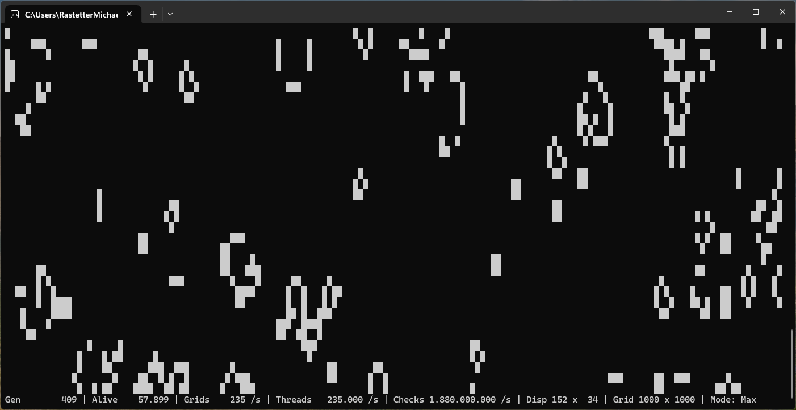

# High-Performance Cellular Automata Engine (.NET 9)

A highly optimized, multi-threaded, and **zero-allocation** simulation engine for *Conway's Game of Life* and *HighLife*, built with **.NET 9**. 

The engine is designed for **maximum throughput on modern multi-core CPUs**, using low-level optimization techniques, cache-friendly memory access patterns, and carefully controlled threading.



---

## Performance & Architecture Highlights

This engine was built with a strong focus on **predictable performance, zero GC overhead, and CPU efficiency**:

### Zero Allocations (Hot Path)
- After initialization, the simulation loop performs **no heap allocations**
- Eliminates GC pauses completely
- Ensures stable frame timing


### Dedicated Worker Threads
- Fixed number of background threads (`Environment.ProcessorCount`)
- No ThreadPool, no `Parallel.For`
- No task scheduling overhead
- Threads remain alive for the full application lifecycle

### Barrier-Based Synchronization
- Uses `System.Threading.Barrier` for precise coordination
- Two-phase execution model:
  1. Start work
  2. Wait for completion
- No busy-waiting, no polling


### Compile-Time Polymorphism
- Uses `struct`-based generics instead of virtual calls:
  ```csharp
  UpdatePatternGeneric<TRule, TStrategy>
 
 
### Compile-Time Polymorphism
```csharp
UpdatePatternGeneric<TRule, TStrategy>
```

- Uses `struct` constraints instead of virtual calls
- Fully inlined by the JIT
- Zero dispatch overhead


### Branchless Rule Execution
- Uses bitwise operations instead of `if`/`else`
- Eliminates branch prediction penalties


### Double Buffering
- Reads from `_currentGrid`
- Writes to `_nextGrid`
- Swaps references each tick

```csharp
(_nextGrid, _currentGrid) = (_currentGrid, _nextGrid);
```

### Cache-Friendly Layout
- Flat `bool[]` array
- Row-based chunking per thread
- No false sharing


### High-Performance Statistics
- Lock-free (`Interlocked`, `Volatile`)
- Snapshot-based via `GetStats()`
- Timing via `Environment.TickCount64`

---

## Features

* **Multiple Rulesets:** Supports classic *Conway's Game of Life* (B3/S23) and *HighLife* (B36/S23), which features native replicator patterns. An interface to implement further rules is provided.
* **Multiple Neighborhoods:** Toggle between *Moore Neighborhood* (8 surrounding cells) and *Von Neumann Neighborhood* (4 orthogonal cells). An interface to implement further neighbourhoods is provided.
* **Flexible Topologies:** Configure the board as a bounded finite grid or a *Toroidal grid* (seamless wrapping around edges).
* **RLE Pattern Parser:** Built-in support to parse and load standard `.rle` (Run-Length Encoded) files directly onto the grid with free positioning of the patterns.
* **Real-time Performance HUD:** Tracks and displays Generations, Living Cells, Grids/sec (Updates Per Second), Threads/sec, and microscopic Cell Checks/sec.

---

## Configuration (`settings.json`)

The application automatically loads or generates a default configuration file on startup:

```json
{
  "Width": 1000,
  "Height": 1000,
  "Toroidal": true,
  "RuleType": "Conway",
  "NeighbourType": "Moore",
  "UseRandomPattern": true,
  "Density": 0.3,
  "RlePath": "patterns/gosper_glider_gun.rle",
  "FpsRate": 10,
  "StartupMode": "Fast",
  "ShowHelpScreen": true
}